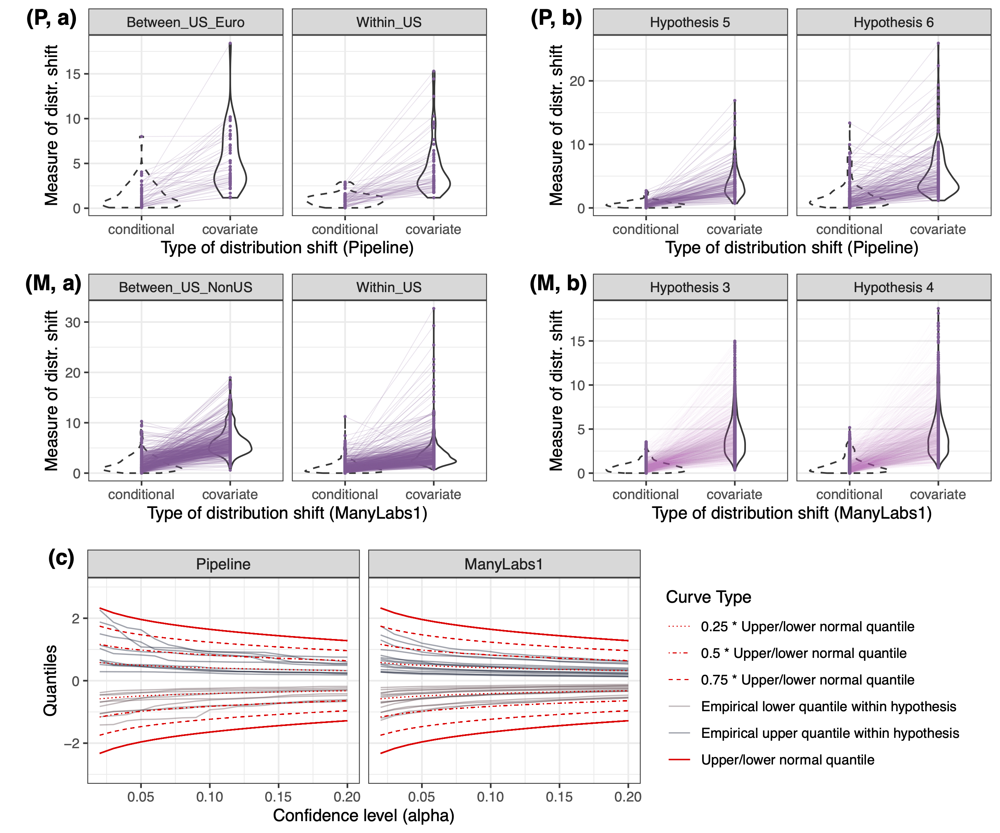
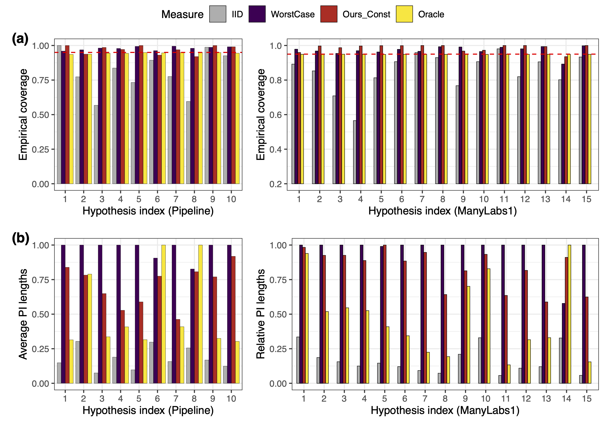
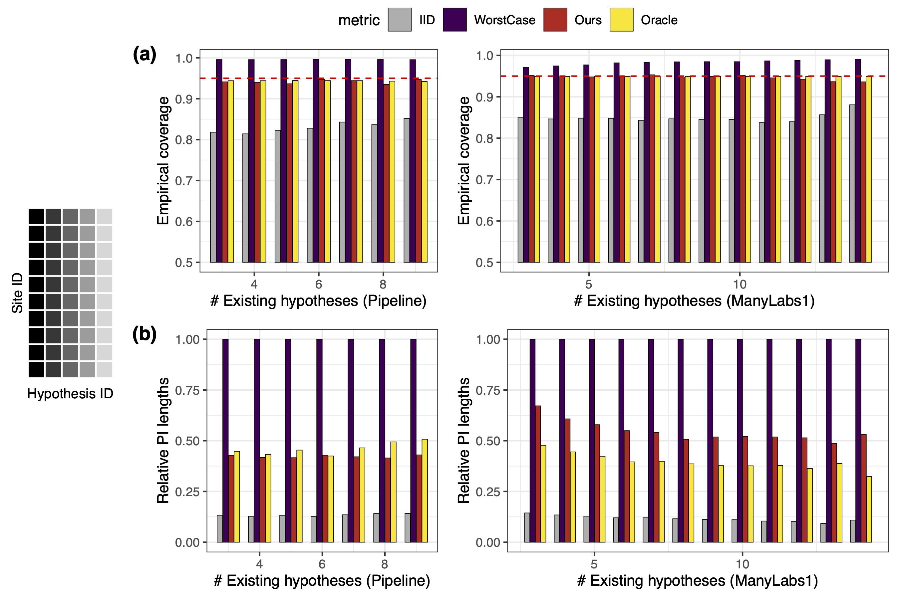

<h1 align="center">
<p> predictive-shift
</h1>

This repository hosts reproduction code for analysis in the paper [Beyond reweighting: On the predictive role of covariate shift in effect generalization](https://arxiv.org/abs/2412.08869)" by Ying Jin, Naoki Egami and Dominik Rothenhäusler. [[Reference](#reference)]


> :bulb: Refer to [[awesome-replicability-data](https://github.com/ying531/awesome-replicability-data)] for more replication data, including the two projects in this paper!


## Folder organization 

The files are ordered as follows:
- `master.R`: R script for the entire workflow, including pre-processing and reproducing the analyses and plots in the main text. See this file for usage of individual R scripts. 
- `ManyLabs1`: scripts for reproducing analysis and intermediate results (which may take a long time to compute) for easy reproduction for the ManyLabs1 datasets. 
    - `ManyLabs1/pre-process/`: scripts for pre-processing the raw datasets downloadable from the [OSF repository](https://osf.io/wx7ck/). 
    - `ManyLabs1/explanatory/`: analysis for the explanatory role (Figure 3).
    - `ManyLabs1/predictive/`: scripts for computing distribution shift measures.
    - `ManyLabs1/generalization/`: scripts for computing KL-based prediction intervals in Section 4.
- `Pipeline`: scripts for reproducing analysis and intermediate results (which may take a long time to compute) for easy reproduction for the Pipeline datasets, similar to above. 
    - `Pipeline/pre-process/`: scripts for pre-processing the raw datasets downloadable from the [OSF repository](https://osf.io/wx7ck/) and the cleaned datasets for analysis. 
    - `Pipeline/explanatory/`: analysis for the explanatory role (Figure 3).
    - `Pipeline/predictive/`: scripts for computing distribution shift measures.
    - `Pipeline/generalization/`: scripts for computing KL-based prediction intervals in Section 4.
- `summary`: scripts for analyses (such as building prediction intervals, calibrating distribution shift ratios, constructing generalization intervals) built upon results from the above two parts. 
- `plots_main.R`: script for reproducing plots in the main texts based on the analyses.


## Usage


#### Preparation steps

- Set `ROOT_DIR` in the R scripts as the root directory of this github repository.
- After processing the data, set `ML_DATA_PATH` as the path to the processed ManyLabs1 data file, and `PP_DATA_PATH` as the path to the directory that contains the cleaned datasets. 

These variables will be referenced by all analysis scripts.  

#### Entire workflow

- Run `master.R` for producing all the results, but this can take a long time. 

#### Computing baseline methods 

- Running `/Pipeline/explanatory/explanatory.R` saves data files `results_plain_PP.RData` for prediction intervals based on iid assumption, and `results_weighted_PP.RData` for prediction intervals based on covariate shift assumption. 
- Running `/ManyLabs1/explanatory/explanatory.R` saves data files `results_plain_ML1.RData` for prediction intervals based on iid assumption, and `results_weighted_ML1.RData` for prediction intervals based on covariate shift assumption. 
- To save time, we provide these four files in the corresponding folders. Running `/summary/summary_explanatory.R` processes these files and generate data ready for reproducing Figure 3 as below. 

<center>
<figure>
  
  <figcaption><em>Distribution shift across sites is non-negligible, and adjusting for covariate shift is not sufficient.</em></figcaption>
</figure>
</center>
 

#### Computing distribution shift measures

- Running `/Pipeline/predictive/stable_shift.R` saves a data file `results_K5_stable_filtered_centered.RData` for distribution shift measures (and intermediary quantities) for all data pairs and all hypotheses in the Pipeline dataset. 
- Running `/ManyLabs1/predictive/stable_shift.R` saves a data file `results_stable_ML1.RData` for distribution shift measures (and intermediary quantities) for all site pairs and all hypotheses in the ManyLabs1 dataset. 
- To save time, these files are provided. Running `/summary/summary_predictive.R` processes these files and generate data ready for reproducing Figure 4 as below. 

<center>
<figure>
  
  <figcaption><em>Our covariate shift measure often bounds the conditional shift measure with normal-like empirical quantiles.</em></figcaption>
</figure>
</center>

#### Computing generalization tasks (constant calibration)

- Running `/Pipeline/generalization/compute_KL_delta.R` computes the conditional KL divergence between sites, stored in `cond_KL_delta_PP.RData`. Similarly for ManyLabs1.
- Running `/Pipeline/generalization/KL_no_aux_data.R` computes KL-based PIs based on worst-case bounds calibrated in each hypothesis, stored in `cond_KL_PIs_PP.RData`. Similarly for ManyLabs1.
- These files are provided in the folder, and running `/summary/summary_const_calib.R` prepares summary data to produce Figure 7 in the paper as below.  

<center>
<figure>
  
  <figcaption><em>Exploiting the bounding relationship leads to valid and efficient generalization.</em></figcaption>
</figure>
</center>

#### Computing generalization tasks (data-adaptive calibration)


- Running `/Pipeline/generalization/study_adaptive.R` computes KL-based PIs with data-adaptive calibration, stored in `KL_calib_study.RData`. Similarly for ManyLabs1. 
- These experiments are time-consuming. The files are provided, and running `/summary/summary_data_calib.R` prepares summary data to produce Figure 8 in the paper as below. 

<center>
<figure>
  
  <figcaption><em>Calibrating the ratio between conditional and covariate shift measures leads to valid and efficient generalization.</em></figcaption>
</figure>
</center>

#### Producing figures 

- Running `/plots_main.R` builds upon the above analyses results to create the five plots in the main text. 


### Reference  

<a name="reference"></a>
```
@article{jin2024beyond,
  title={Beyond reweighting: On the predictive role of covariate shift in effect generalization},
  author={Jin, Ying and Egami, Naoki and Rothenh{\"a}usler, Dominik},
  journal={arXiv preprint arXiv:2412.08869},
  year={2024}
}
```


### Acknowledgments 

Special thanks to  Diana Da In Le for contributing the data pre-processing code for the ManyLabs1 dataset.
