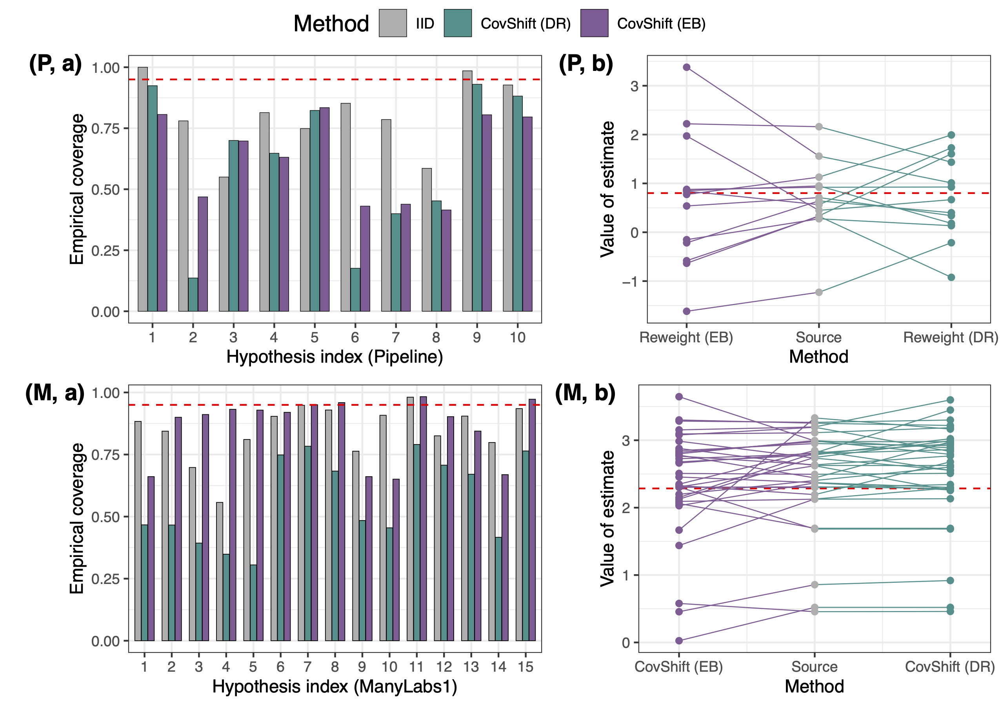

<h1 align="center">
<p> predictive-shift
</h1>

This repository hosts reproduction code for analysis in the paper [Beyond reweighting: On the predictive role of covariate shift in effect generalization]()" by Ying Jin, Naoki Egami and Dominik Rothenhäusler. [[Reference](#reference2)]


> :bulb: Refer to [[awesome-replicability-data](https://github.com/ying531/awesome-replicability-data)] for more replication data sources, including the two projects in this paper!


## Folder organization 

The files are ordered as follows:
- `master.R`: R script for the entire workflow, including pre-processing and reproducing the analyses and plots in the main text. See this file for usage of individual R scripts. 
- `ManyLabs1`: scripts for reproducing analysis and intermediate results (which may take a long time to compute) for easy reproduction for the ManyLabs1 datasets. 
    - `ManyLabs1/pre-process`: scripts for pre-processing the raw datasets downloadable from the [OSF repository](https://osf.io/wx7ck/). 
    - `ManyLabs1/explanatory`: analysis for the explanatory role (Figure 3), including prediction intervals based on iid assumption and covariate shift assumption.
    - `ManyLabs1/predictive`: scripts for computing distribution shift measures, which will be used in illustrating the predictive role of covariate shift and constructing generalization intervals.
    - `ManyLabs1/generalization`: scripts for computing KL-based prediction intervals in Section 4, including constant calibration and data-adaptive calibration (our methods will be computed in summary scripts based on computed distribution shift measures).
- `Pipeline`: scripts for reproducing analysis and intermediate results (which may take a long time to compute) for easy reproduction for the Pipeline datasets, similar to above. 
    - `Pipeline/pre-process`: scripts for pre-processing the raw datasets downloadable from the [OSF repository](https://osf.io/wx7ck/) and the cleaned datasets for analysis. 
    - `Pipeline/explanatory`: analysis for the explanatory role (Figure 3).
    - `Pipeline/predictive`: scripts for computing distribution shift measures.
    - `Pipeline/generalization`: scripts for computing KL-based prediction intervals in Section 4.
- `summary`: scripts for summarizing intermediate results, such as building prediction intervals, calibrating distribution shift ratios, constructing generalization intervals, all built upon results from the above two parts. 
- `plots_main.R`: script for reproducing plots in the main texts based on analysis in the `summary' folder. 


## Usage


#### Preparation steps

- Set `ROOT_DIR` in the R scripts as the root directory of this github repository, which will be referenced by all scripts.
- After processing the data, set `ML_DATA_PATH` as the path to the processed ManyLabs1 data file, and `PP_DATA_PATH` as the path to the directory that contains the cleaned datasets. They will also be referenced by all scripts.  

#### Entire workflow

- Run `master.R` for producing all the results, but this can take a long time. 

#### Computing baseline methods 

- Running `/Pipeline/explanatory/explanatory.R` saves data files `results_plain_PP.RData` for prediction intervals based on iid assumption, and `results_weighted_PP.RData` for prediction intervals based on covariate shift assumption. 
- Running `/ManyLabs1/explanatory/explanatory.R` saves data files `results_plain_ML1.RData` for prediction intervals based on iid assumption, and `results_weighted_ML1.RData` for prediction intervals based on covariate shift assumption. 
- To save time, we have provided these four files in the corresponding folders. Running `/summary/summary_explanatory.R` processes these files and generate data ready for reproducing Figure 3 in the paper as below. 

<p align="center">
   
  <em>Distribution shift across sites is non-negligible, and adjusting for covariate shift is not sufficient.</em>
</p> 

#### Computing distribution shift measures

- Running `/Pipeline/predictive/stable_shift.R` saves a data file `results_K5_stable_filtered_centered.RData` for distribution shift measures (and intermediary quantities) for all data pairs and all hypotheses in the Pipeline dataset. 
- Running `/ManyLabs1/predictive/stable_shift.R` saves a data file `results_stable_ML1.RData` for distribution shift measures (and intermediary quantities) for all site pairs and all hypotheses in the ManyLabs1 dataset. 


### Acknowledgments 

Special thanks to  Diana Da In Le for offering the data pre-processing code for the ManyLabs1 dataset.

### Reference  

<a name="reference"></a>
```
@article{jin2024beyond,
  title={Beyond reweighting: On the predictive role of covariate shift in effect generalization},
  author={Jin, Ying and Egami, Naoki and Rothenh{\"a}usler, Dominik},
  journal={arXiv preprint },
  year={2023}
}
```